Nama: Indi Warda Ramadhani
 NIM: 2341760026
 Kelas: SIB 3D
 Mata Kuliah: Pemrograman Mobile

**Dasar Manajemen State di Flutter**

**Praktikum 1: Dasar State dengan Model-View**

Langkah 1: Buat Project Baru

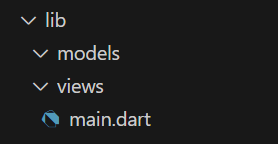

Langkah 2: Membuat model task.dart

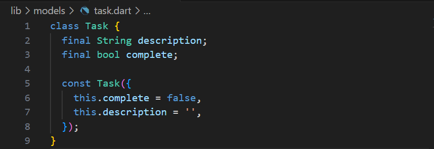

Langkah 3: Buat file plan.dart

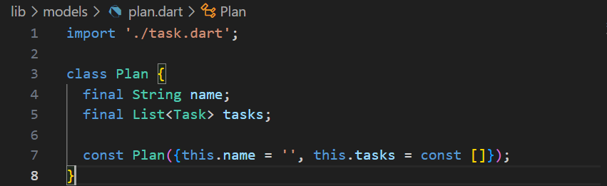

Langkah 4: Buat file data_layer.dart

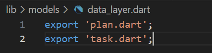

Langkah 5: Pindah ke file main.dart

Langkah 6: buat plan_screen.dart

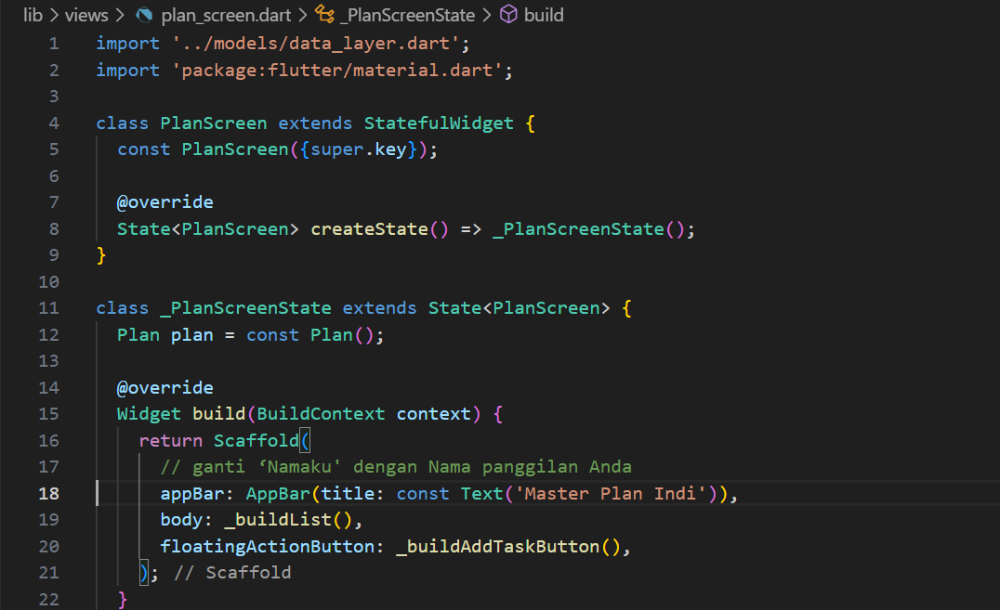

Langkah 7: buat method _buildAddTaskButton()

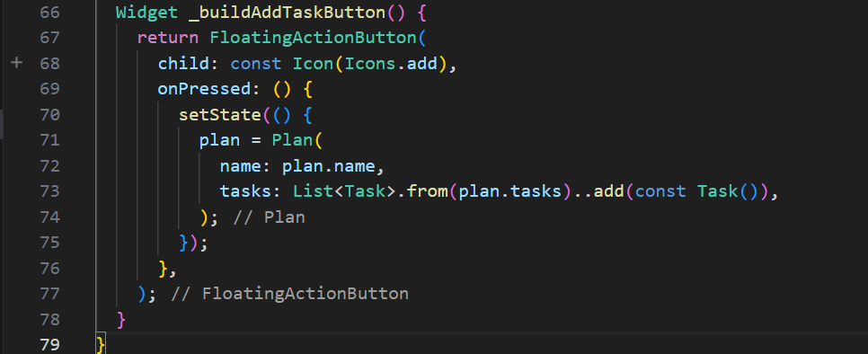

Langkah 8: buat widget _buildList()

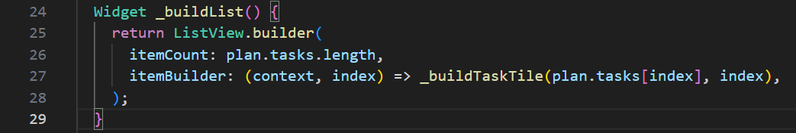

Langkah 9: buat widget _buildTaskTile

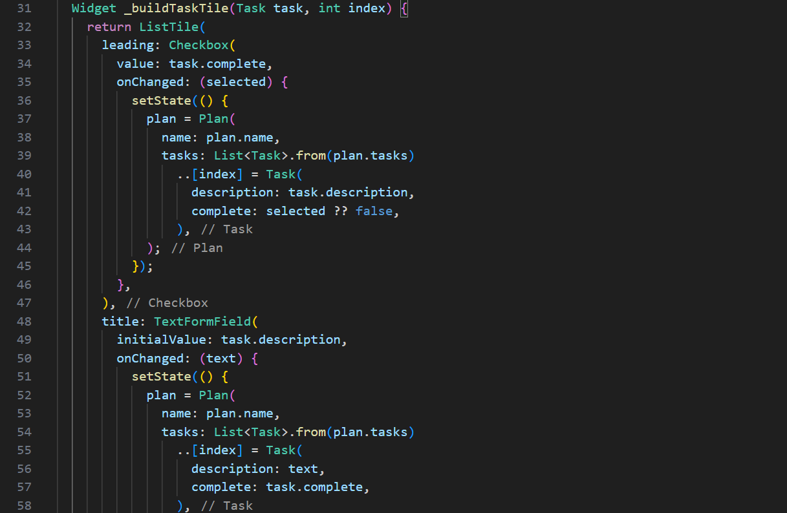

Langkah 10: Tambah Scroll Controller

Langkah 11: Tambah Scroll Listener

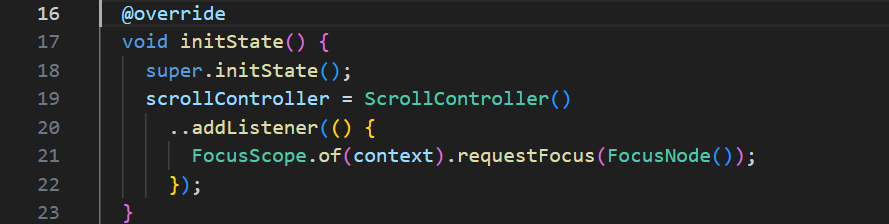

Langkah 12: Tambah controller dan keyboard behavior

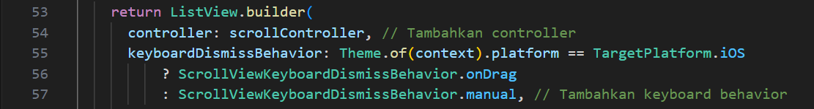

Langkah 13: Terakhir, tambah method dispose()

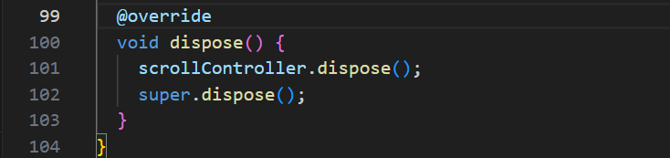

Langkah 14: Hasil

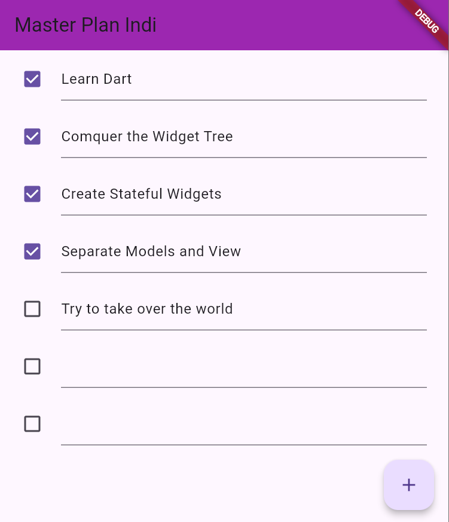

**Tugas Praktikum 1: Dasar State dengan Model-View**

1.	Selesaikan langkah-langkah praktikum tersebut, lalu dokumentasikan berupa GIF hasil akhir praktikum beserta penjelasannya di file README.md! Jika Anda menemukan ada yang error atau tidak berjalan dengan baik, silakan diperbaiki.

2.	Jelaskan maksud dari langkah 4 pada praktikum tersebut! Mengapa dilakukan demikian?

File data_layer.dart dibuat khusus untuk mengelompokkan semua file model yang dipakai di proyek Flutter (contohnya plan.dart serta task.dart), sehingga aksesnya bisa dilakukan hanya dari satu titik saja. Manfaat utamanya meliputi: · Memudahkan dalam mengatur model data secara terpusat. · Mengurangi kebutuhan menulis ulang import di berbagai file. · Mempertahankan organisasi proyek agar tetap terstruktur dan mudah dikembangkan. Kata kunci export dalam Dart berperan untuk mendistribusikan (mengekspor) isi file ke file lain yang mengimpor data_layer.dart. Secara ringkas: · Import = mengambil potongan kode dari file eksternal untuk dipakai. · Export = menyediakan kode agar bisa diakses oleh file lain.

3.	Mengapa perlu variabel plan di langkah 6 pada praktikum tersebut? Mengapa dibuat konstanta ?

Variabel plan berfungsi untuk menyimpan informasi inti dari aplikasi, yakni rencana (plan) yang mencakup seluruh daftar tugas (tasks). Setiap modifikasi seperti penambahan, pengubahan, atau penandaan tugas akan tercatat langsung di variabel plan ini. Variabel plan diciptakan untuk menampung kumpulan rencana maupun tugas. Mengingat saat aplikasi pertama kali diluncurkan, isinya masih nihil dan belum mengalami perubahan, maka dipilih const supaya lebih hemat sumber daya dan mempercepat proses rendering tampilan oleh Flutter.

4.	Lakukan capture hasil dari Langkah 9 berupa GIF, kemudian jelaskan apa yang telah Anda buat!

Aplikasi Master Plan memamerkan daftar tugas lengkap dengan opsi centang serta tombol “+” guna menambahkan item tugas anyar. Desainnya dilengkapi AppBar berwarna ungu dengan teks judul “Master Plan Indi”. Fungsi initState() dimanfaatkan untuk mengonfigurasi scrollController sehingga keyboard akan otomatis hilang saat pengguna menggulir, sementara dispose() bertugas membebaskan scrollController demi mencegah pemborosan memori.

5.	Apa kegunaan method pada Langkah 11 dan 13 dalam lifecyle state ?

Di Tahap 11, method initState() dipakai untuk mengeksekusi instruksi awal tepat setelah halaman dibuat. Khususnya, initState() di sini mengatur inisialisasi scrollController serta memasang listener, sehingga ketika pengguna menggulir, keyboard akan menutup sendiri. Hal ini menjaga agar antarmuka tetap bersih dan tidak menghalangi area input teks di bagian bawah. Sementara itu, pada Tahap 13, method dispose() bertugas membersihkan sumber daya atau alokasi memori yang tak lagi dibutuhkan saat halaman ditutup. Dalam konteks ini, dispose() menghapus scrollController untuk menghindari masalah kebocoran memori (memory leak) pada aplikasi.
